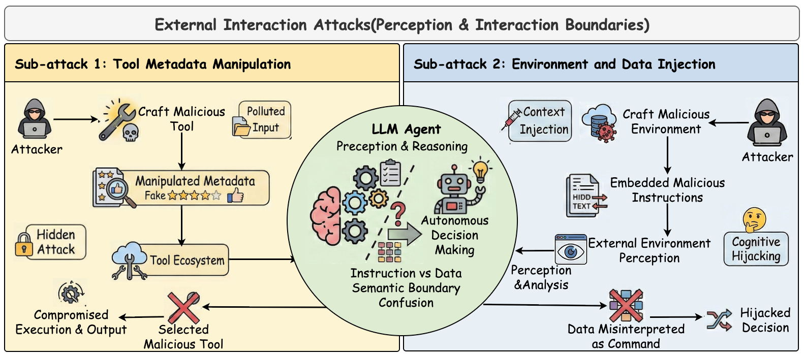
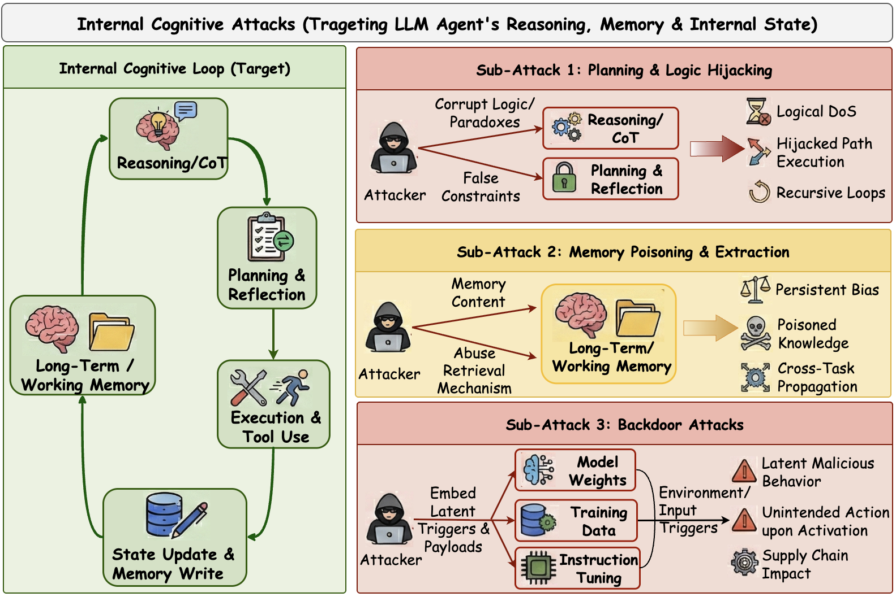
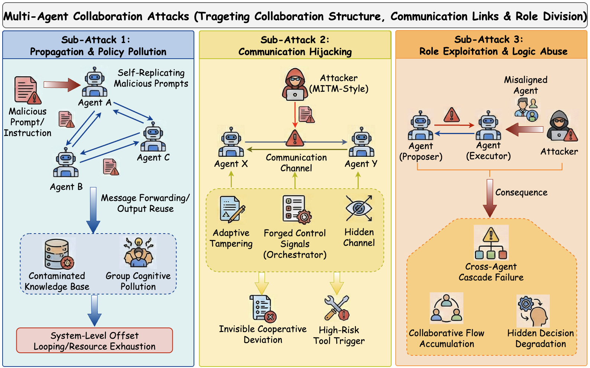
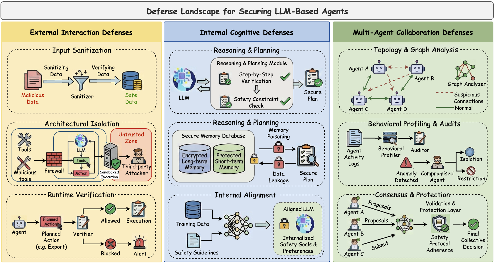

# Attacks and Defenses in Differentially Private Deep Learning: New Security Risks in New Era
<a href="https://www.preprints.org/manuscript/202603.1179" 
   target="_blank" 
   style="display: inline-block; padding: 10px 20px; background-color: #24292e; color: white; text-decoration: none; border-radius: 6px; font-weight: bold;">
   📥 Download Full Paper (PDF)
</a>


With the rapid advancement of deep learning, differential privacy has become a key technique for protecting sensitive data with a formal guarantee of privacy. By injecting noise and enforcing privacy budgets, differentially private deep learning (DP-DL) systems are able to protect individual data points yet still maintain a model’s utility. However, recent studies reveal that DP-DL systems can be vulnerable to different types of attacks throughout their lifecycle. Naturally, this has attracted the attention of both academia and industry. Critically, these risks are not the same as those associated with traditional deep learning. This is because the differential privacy mechanism itself introduces new attack surfaces that adversaries can exploit. Our work focuses on the distinct vulnerabilities that can arise at the data, algorithm, and architecture levels. By analyzing representative attacks and corresponding defenses, this survey highlights emerging challenges and outlines promising research directions. Overall, our aim is to make differential privacy more robust and deployable in real-world deep learning systems.

**📍 This survey systematically examines attacks and defenses on DP-DL systems from three perspectives: data level, algorithm level, and architecture level.**


## Update Records
- 2026-03-16: The first version of our survey has been released on preprints.

## Table of Contents
- [Risks in DP-DL](#Risks-in-DP-DL)
- [Attacks on DP-DL systems](#Attacks-on-DP-DL-systems)
- [Defenses for DP-DL systems](#Defenses-for-DP-DL-systems)
- [Defenses](#defenses)
- [Update Records](#update-records)
- [Paper List](#paper-list)
  - [Risks in DP-DL](#Risks-in-DP-DL)
  - [Attacks on DP-DL systems](#Attacks-on-DP-DL-systems)
  - [Defenses for DP-DL systems](#Defenses-for-DP-DL-systems)
  - [Defenses against External Interaction Attacks](#defenses-against-external-interaction-attacks)
  - [Defenses against Internal Cognitive Attacks](#defenses-against-internal-cognitive-attacks)
  - [Defenses against Multi-Agent Collaboration Attacks](#defenses-against-multi-agent-collaboration-attacks)
  - [Security Frameworks](#security-frameworks)
  - [Security Benchmarks](#security-benchmarks)
- [Citation](#citation)
- [Acknowledgement](#acknowledgement)
- [Contact Us](#contact-us)

## Risks in DP-DL
Focus: attacks on the agent-environment interface, including tool metadata manipulation and environment/data injection.



## Attacks on DP-DL systems
Focus: attacks on planning, reasoning, memory, and model internals, with persistent and covert effects.



## Defenses for DP-DL systems
Focus: attacks on communication, coordination logic, and role trust in multi-agent systems.



## Defenses
Focus: defense design space for external interaction attacks, internal cognitive attacks, and multi-agent collaboration attacks.




## Paper List

### External Interaction Attacks
- AdvAgent: Controllable Blackbox Red-teaming on Web Agents, Forty-second International Conference on Machine Learning 2025.01 [[paper](https://scholar.google.com/scholar?q=AdvAgent%3A%20Controllable%20Blackbox%20Red-teaming%20on%20Web%20Agents)]
- EIA: ENVIRONMENTAL INJECTION ATTACK ON GENERALIST WEB AGENTS FOR PRIVACY LEAKAGE, The Thirteenth International Conference on Learning Representations 2025.01 [[paper](https://scholar.google.com/scholar?q=EIA%3A%20ENVIRONMENTAL%20INJECTION%20ATTACK%20ON%20GENERALIST%20WEB%20AGENTS%20FOR%20PRIVACY%20LEAKAGE)]
- Wipi: A new web threat for llm-driven web agents, arXiv 2024.02 [[paper](https://arxiv.org/abs/2402.16965)]
- AgentVigil: Generic Black-Box Red-teaming for Indirect Prompt Injection against LLM Agents, arXiv 2025.05 [[paper](https://arxiv.org/abs/2505.05849)]
- Imprompter: Tricking llm agents into improper tool use, arXiv 2024.10 [[paper](https://arxiv.org/abs/2410.14923)]
- Attractive Metadata Attack: Inducing LLM Agents to Invoke Malicious Tools, The Thirty-ninth Annual Conference on Neural Information Processing Systems 2025.01 [[paper](https://scholar.google.com/scholar?q=Attractive%20Metadata%20Attack%3A%20Inducing%20LLM%20Agents%20to%20Invoke%20Malicious%20Tools)]
- Prompt Injection Attack to Tool Selection in LLM Agents, arXiv 2025.04 [[paper](https://arxiv.org/abs/2504.19793)]

### Internal Cognitive Attacks
- UDora: A Unified Red Teaming Framework against LLM Agents by Dynamically Hijacking Their Own Reasoning, Forty-second International Conference on Machine Learning 2025.01 [[paper](https://scholar.google.com/scholar?q=UDora%3A%20A%20Unified%20Red%20Teaming%20Framework%20against%20LLM%20Agents%20by%20Dynamically%20Hijacking%20Their%20Own%20Reasoning)]
- Breaking agents: Compromising autonomous llm agents through malfunction amplification, Proceedings of the 2025 Conference on Empirical Methods in Natural Language Processing 2025.01 [[paper](https://scholar.google.com/scholar?q=Breaking%20agents%3A%20Compromising%20autonomous%20llm%20agents%20through%20malfunction%20amplification)]
- Watch Out for Your Agents! Investigating Backdoor Threats to LLM-Based Agents, The Thirty-eighth Annual Conference on Neural Information Processing Systems 2024.01 [[paper](https://scholar.google.com/scholar?q=Watch%20Out%20for%20Your%20Agents%21%20Investigating%20Backdoor%20Threats%20to%20LLM-Based%20Agents)]
- Unveiling privacy risks in llm agent memory, Proceedings of the 63rd Annual Meeting of the Association for Computational Linguistics (Volume 1: Long Papers) 2025.01 [[paper](https://scholar.google.com/scholar?q=Unveiling%20privacy%20risks%20in%20llm%20agent%20memory)]
- Les Dissonances: Cross-Tool Harvesting and Polluting in Pool-of-Tools Empowered LLM Agents, Unknown Venue 0000.01 [[paper](https://scholar.google.com/scholar?q=Les%20Dissonances%3A%20Cross-Tool%20Harvesting%20and%20Polluting%20in%20Pool-of-Tools%20Empowered%20LLM%20Agents)]
- Agent Smith: A Single Image Can Jailbreak One Million Multimodal LLM Agents Exponentially Fast, Proceedings of the 41st International Conference on Machine Learning (ICML) 2024.07 [[paper](https://scholar.google.com/scholar?q=Agent%20Smith%3A%20A%20Single%20Image%20Can%20Jailbreak%20One%20Million%20Multimodal%20LLM%20Agents%20Exponentially%20Fast)]
- AgentPoison: Red-teaming LLM Agents via Poisoning Memory or Knowledge Bases, The Thirty-eighth Annual Conference on Neural Information Processing Systems 2024.01 [[paper](https://scholar.google.com/scholar?q=AgentPoison%3A%20Red-teaming%20LLM%20Agents%20via%20Poisoning%20Memory%20or%20Knowledge%20Bases)]
- Memory Injection Attacks on LLM Agents via Query-Only Interaction, The Thirty-ninth Annual Conference on Neural Information Processing Systems 2025.01 [[paper](https://scholar.google.com/scholar?q=Memory%20Injection%20Attacks%20on%20LLM%20Agents%20via%20Query-Only%20Interaction)]
- Memory poisoning attacks on retrieval-augmented Large Language Model agents via deceptive semantic reasoning, Engineering Applications of Artificial Intelligence 2026.01 [[paper](https://scholar.google.com/scholar?q=Memory%20poisoning%20attacks%20on%20retrieval-augmented%20Large%20Language%20Model%20agents%20via%20deceptive%20semantic%20reasoning)]
- BadAgent: Inserting and Activating Backdoor Attacks in LLM Agents, Proceedings of the 62nd Annual Meeting of the Association for Computational Linguistics (Volume 1: Long Papers) 2024.01 [[paper](https://scholar.google.com/scholar?q=BadAgent%3A%20Inserting%20and%20Activating%20Backdoor%20Attacks%20in%20LLM%20Agents)]
- Compromising llm driven embodied agents with contextual backdoor attacks, IEEE Transactions on Information Forensics and Security 2025.01 [[paper](https://scholar.google.com/scholar?q=Compromising%20llm%20driven%20embodied%20agents%20with%20contextual%20backdoor%20attacks)]
- Demonagent: Dynamically encrypted multi-backdoor implantation attack on llm-based agent, arXiv 2025.02 [[paper](https://arxiv.org/abs/2502.12575)]

### Multi-Agent Collaboration Attacks
- Prompt infection: Llm-to-llm prompt injection within multi-agent systems, arXiv 2024.10 [[paper](https://arxiv.org/abs/2410.07283)]
- Corba: Contagious recursive blocking attacks on multi-agent systems based on large language models, arXiv 2025.02 [[paper](https://arxiv.org/abs/2502.14529)]
- Agents under siege: Breaking pragmatic multi-agent llm systems with optimized prompt attacks, Proceedings of the 63rd Annual Meeting of the Association for Computational Linguistics (Volume 1: Long Papers) 2025.01 [[paper](https://scholar.google.com/scholar?q=Agents%20under%20siege%3A%20Breaking%20pragmatic%20multi-agent%20llm%20systems%20with%20optimized%20prompt%20attacks)]
- Flooding spread of manipulated knowledge in llm-based multi-agent communities, arXiv 2024.07 [[paper](https://arxiv.org/abs/2407.07791)]
- Red-teaming llm multi-agent systems via communication attacks, Findings of the Association for Computational Linguistics: ACL 2025 2025.01 [[paper](https://scholar.google.com/scholar?q=Red-teaming%20llm%20multi-agent%20systems%20via%20communication%20attacks)]
- Attack the Messages, Not the Agents: A Multi-round Adaptive Stealthy Tampering Framework for LLM-MAS, arXiv 2025.08 [[paper](https://arxiv.org/abs/2508.03125)]
- Multi-agent systems execute arbitrary malicious code, arXiv 2025.03 [[paper](https://arxiv.org/abs/2503.12188)]
- Advances in Neural Information Processing Systems, Advances in Neural Information Processing Systems 2024.01 [[paper](https://scholar.google.com/scholar?q=Advances%20in%20Neural%20Information%20Processing%20Systems)]
- Evil geniuses: Delving into the safety of llm-based agents, arXiv 2023.11 [[paper](https://arxiv.org/abs/2311.11855)]
- On the Resilience of LLM-Based Multi-Agent Collaboration with Faulty Agents, Forty-second International Conference on Machine Learning 2025.01 [[paper](https://scholar.google.com/scholar?q=On%20the%20Resilience%20of%20LLM-Based%20Multi-Agent%20Collaboration%20with%20Faulty%20Agents)]
- Who's the Mole? Modeling and Detecting Intention-Hiding Malicious Agents in LLM-Based Multi-Agent Systems, arXiv 2025.07 [[paper](https://arxiv.org/abs/2507.04724)]
- Ip leakage attacks targeting llm-based multi-agent systems, arXiv 2025.05 [[paper](https://arxiv.org/abs/2505.12442)]

#### Defenses against External Interaction Attacks
- Promptarmor: Simple yet effective prompt injection defenses, arXiv 2025.07 [[paper](https://arxiv.org/abs/2507.15219)]
- To Protect the LLM Agent Against the Prompt Injection Attack with Polymorphic Prompt, 2025 55th Annual IEEE/IFIP International Conference on Dependable Systems and Networks - Supplemental Volume (DSN-S) 2025.01 [[paper](https://scholar.google.com/scholar?q=To%20Protect%20the%20LLM%20Agent%20Against%20the%20Prompt%20Injection%20Attack%20with%20Polymorphic%20Prompt)]
- IsolateGPT: An Execution Isolation Architecture for LLM-Based Agentic Systems, NDSS 2025.01 [[paper](https://scholar.google.com/scholar?q=IsolateGPT%3A%20An%20Execution%20Isolation%20Architecture%20for%20LLM-Based%20Agentic%20Systems)]
- AirGapAgent: Protecting Privacy-Conscious Conversational Agents, Proceedings of the 2024 on ACM SIGSAC Conference on Computer and Communications Security 2024.01 [[paper](https://scholar.google.com/scholar?q=AirGapAgent%3A%20Protecting%20Privacy-Conscious%20Conversational%20Agents)]
- CaMeLs Can Use Computers Too: System-level Security for Computer Use Agents, arXiv 2026.01 [[paper](https://arxiv.org/abs/2601.09923)]
- The task shield: Enforcing task alignment to defend against indirect prompt injection in llm agents, Proceedings of the 63rd Annual Meeting of the Association for Computational Linguistics (Volume 1: Long Papers) 2025.01 [[paper](https://scholar.google.com/scholar?q=The%20task%20shield%3A%20Enforcing%20task%20alignment%20to%20defend%20against%20indirect%20prompt%20injection%20in%20llm%20agents)]
- MELON: Provable Defense Against Indirect Prompt Injection Attacks in AI Agents, Proceedings of the 42nd International Conference on Machine Learning (ICML) 2025.01 [[paper](https://scholar.google.com/scholar?q=MELON%3A%20Provable%20Defense%20Against%20Indirect%20Prompt%20Injection%20Attacks%20in%20AI%20Agents)]
- ShieldAgent: Shielding Agents via Verifiable Safety Policy Reasoning, Forty-second International Conference on Machine Learning 2025.01 [[paper](https://scholar.google.com/scholar?q=ShieldAgent%3A%20Shielding%20Agents%20via%20Verifiable%20Safety%20Policy%20Reasoning)]
- Ipiguard: A novel tool dependency graph-based defense against indirect prompt injection in llm agents, Proceedings of the 2025 Conference on Empirical Methods in Natural Language Processing 2025.01 [[paper](https://scholar.google.com/scholar?q=Ipiguard%3A%20A%20novel%20tool%20dependency%20graph-based%20defense%20against%20indirect%20prompt%20injection%20in%20llm%20agents)]
- DRIFT: Dynamic Rule-Based Defense with Injection Isolation for Securing LLM Agents, arXiv 2025.06 [[paper](https://arxiv.org/abs/2506.12104)]
- ALRPHFS: Adversarially Learned Risk Patterns with Hierarchical Fast& Slow Reasoning for Robust Agent Defense, arXiv 2025.05 [[paper](https://arxiv.org/abs/2505.19260)]

#### Defenses against Internal Cognitive Attacks
- Your Agent Can Defend Itself against Backdoor Attacks, arXiv 2025.06 [[paper](https://arxiv.org/abs/2506.08336)]
- A Survey on Autonomy-Induced Security Risks in Large Model-Based Agents, arXiv 2025.06 [[paper](https://arxiv.org/abs/2506.23844)]
- Get Experience from Practice: LLM Agents with Record & Replay, arXiv 2025.05 [[paper](https://arxiv.org/abs/2505.17716)]
- Check Yourself Before You Wreck Yourself: Selectively Quitting Improves LLM Agent Safety, arXiv 2025.10 [[paper](https://arxiv.org/abs/2510.16492)]
- A-MemGuard: A Proactive Defense Framework for LLM-Based Agent Memory, arXiv 2025.10 [[paper](https://arxiv.org/abs/2510.02373)]
- Agentsafe: Safeguarding large language model-based multi-agent systems via hierarchical data management, arXiv 2025.03 [[paper](https://arxiv.org/abs/2503.04392)]
- Memory Poisoning Attack and Defense on Memory Based LLM-Agents, arXiv 2026.01 [[paper](https://arxiv.org/abs/2601.05504)]
- AdvEvo-MARL: Shaping Internalized Safety through Adversarial Co-Evolution in Multi-Agent Reinforcement Learning, arXiv 2025.10 [[paper](https://arxiv.org/abs/2510.01586)]
- Real ai agents with fake memories: Fatal context manipulation attacks on web3 agents, arXiv 2025.03 [[paper](https://arxiv.org/abs/2503.16248)]

#### Defenses against Multi-Agent Collaboration Attacks
- G-Safeguard: A Topology-Guided Security Lens and Treatment on LLM-based Multi-agent Systems, Proceedings of the 63rd Annual Meeting of the Association for Computational Linguistics (Volume 1: Long Papers) 2025.01 [[paper](https://scholar.google.com/scholar?q=G-Safeguard%3A%20A%20Topology-Guided%20Security%20Lens%20and%20Treatment%20on%20LLM-based%20Multi-agent%20Systems)]
- GUARDIAN: Safeguarding LLM Multi-Agent Collaborations with Temporal Graph Modeling, arXiv 2025.05 [[paper](https://arxiv.org/abs/2505.19234)]
- Blindguard: Safeguarding llm-based multi-agent systems under unknown attacks, arXiv 2025.08 [[paper](https://arxiv.org/abs/2508.08127)]
- INFA-Guard: Mitigating Malicious Propagation via Infection-Aware Safeguarding in LLM-Based Multi-Agent Systems, arXiv 2026.01 [[paper](https://arxiv.org/abs/2601.14667)]
- Who's the Mole? Modeling and Detecting Intention-Hiding Malicious Agents in LLM-Based Multi-Agent Systems, arXiv 2025.07 [[paper](https://arxiv.org/abs/2507.04724)]
- MedSentry: Understanding and Mitigating Safety Risks in Medical LLM Multi-Agent Systems, arXiv 2025.05 [[paper](https://arxiv.org/abs/2505.20824)]
- 2025 IEEE International Conference on Information Reuse and Integration and Data Science (IRI), 2025 IEEE International Conference on Information Reuse and Integration and Data Science (IRI) 2025.01 [[paper](https://scholar.google.com/scholar?q=2025%20IEEE%20International%20Conference%20on%20Information%20Reuse%20and%20Integration%20and%20Data%20Science%20%28IRI%29)]
- On the Resilience of LLM-Based Multi-Agent Collaboration with Faulty Agents, Forty-second International Conference on Machine Learning 2025.01 [[paper](https://scholar.google.com/scholar?q=On%20the%20Resilience%20of%20LLM-Based%20Multi-Agent%20Collaboration%20with%20Faulty%20Agents)]
- Enhancing robustness of LLM-driven multi-agent systems through randomized smoothing, Chinese Journal of Aeronautics 2025.01 [[paper](https://scholar.google.com/scholar?q=Enhancing%20robustness%20of%20LLM-driven%20multi-agent%20systems%20through%20randomized%20smoothing)]
- CoTGuard: Using Chain-of-Thought Triggering for Copyright Protection in Multi-Agent LLM Systems, arXiv 2025.05 [[paper](https://arxiv.org/abs/2505.19405)]

#### Security Frameworks
- Aios: Llm agent operating system, arXiv 2024.03 [[paper](https://arxiv.org/abs/2403.16971)]
- IsolateGPT: An Execution Isolation Architecture for LLM-Based Agentic Systems, NDSS 2025.01 [[paper](https://scholar.google.com/scholar?q=IsolateGPT%3A%20An%20Execution%20Isolation%20Architecture%20for%20LLM-Based%20Agentic%20Systems)]
- Airgapagent: Protecting privacy-conscious conversational agents, Proceedings of the 2024 on ACM SIGSAC Conference on Computer and Communications Security 2024.01 [[paper](https://scholar.google.com/scholar?q=Airgapagent%3A%20Protecting%20privacy-conscious%20conversational%20agents)]
- Security of ai agents, 2025 IEEE/ACM International Workshop on Responsible AI Engineering (RAIE) 2025.01 [[paper](https://scholar.google.com/scholar?q=Security%20of%20ai%20agents)]
- TrustAgent: Towards Safe and Trustworthy LLM-based Agents through Agent Constitution, Trustworthy Multi-modal Foundation Models and AI Agents (TiFA) 2024.01 [[paper](https://scholar.google.com/scholar?q=TrustAgent%3A%20Towards%20Safe%20and%20Trustworthy%20LLM-based%20Agents%20through%20Agent%20Constitution)]
- ShieldAgent: Shielding Agents via Verifiable Safety Policy Reasoning, Forty-second International Conference on Machine Learning 2025.01 [[paper](https://scholar.google.com/scholar?q=ShieldAgent%3A%20Shielding%20Agents%20via%20Verifiable%20Safety%20Policy%20Reasoning)]
- Position: Trustworthy AI Agents Require the Integration of Large Language Models and Formal Methods, Forty-second International Conference on Machine Learning Position Paper Track 2025.01 [[paper](https://scholar.google.com/scholar?q=Position%3A%20Trustworthy%20AI%20Agents%20Require%20the%20Integration%20of%20Large%20Language%20Models%20and%20Formal%20Methods)]
- AgentBreeder: Mitigating the AI Safety Impact of Multi-Agent Scaffolds via Self-Improvement, Scaling Self-Improving Foundation Models without Human Supervision 2025.01 [[paper](https://scholar.google.com/scholar?q=AgentBreeder%3A%20Mitigating%20the%20AI%20Safety%20Impact%20of%20Multi-Agent%20Scaffolds%20via%20Self-Improvement)]
- Shapley-Coop: Credit Assignment for Emergent Cooperation in Self-Interested LLM Agents, arXiv 2025.06 [[paper](https://arxiv.org/abs/2506.07388)]
- Securing agentic ai: A comprehensive threat model and mitigation framework for generative ai agents, arXiv 2025.04 [[paper](https://arxiv.org/abs/2504.19956)]
- Sentinel Agents for Secure and Trustworthy Agentic AI in Multi-Agent Systems, arXiv 2025.09 [[paper](https://arxiv.org/abs/2509.14956)]
- Llamafirewall: An open source guardrail system for building secure ai agents, arXiv 2025.05 [[paper](https://arxiv.org/abs/2505.03574)]

#### Security Benchmarks
- AgentHarm: A Benchmark for Measuring Harmfulness of LLM Agents, The Thirteenth International Conference on Learning Representations 2025.01 [[paper](https://scholar.google.com/scholar?q=AgentHarm%3A%20A%20Benchmark%20for%20Measuring%20Harmfulness%20of%20LLM%20Agents)]
- OpenAgentSafety: A Comprehensive Framework for Evaluating Real-World AI Agent Safety, arXiv 2025.07 [[paper](https://arxiv.org/abs/2507.06134)]
- Agentauditor: Human-level safety and security evaluation for llm agents, arXiv 2025.06 [[paper](https://arxiv.org/abs/2506.00641)]
- Ali-agent: Assessing llms' alignment with human values via agent-based evaluation, Advances in Neural Information Processing Systems 2024.01 [[paper](https://scholar.google.com/scholar?q=Ali-agent%3A%20Assessing%20llms%27%20alignment%20with%20human%20values%20via%20agent-based%20evaluation)]
- Identifying the Risks of LM Agents with an LM-Emulated Sandbox, The Twelfth International Conference on Learning Representations 2024.01 [[paper](https://scholar.google.com/scholar?q=Identifying%20the%20Risks%20of%20LM%20Agents%20with%20an%20LM-Emulated%20Sandbox)]
- Agentdojo: A dynamic environment to evaluate prompt injection attacks and defenses for llm agents, Advances in Neural Information Processing Systems 2024.01 [[paper](https://scholar.google.com/scholar?q=Agentdojo%3A%20A%20dynamic%20environment%20to%20evaluate%20prompt%20injection%20attacks%20and%20defenses%20for%20llm%20agents)]
- ToolFuzz--Automated Agent Tool Testing, arXiv 2025.03 [[paper](https://arxiv.org/abs/2503.04479)]
- Agent Security Bench (ASB): Formalizing and Benchmarking Attacks and Defenses in LLM-based Agents, The Thirteenth International Conference on Learning Representations 2025.01 [[paper](https://scholar.google.com/scholar?q=Agent%20Security%20Bench%20%28ASB%29%3A%20Formalizing%20and%20Benchmarking%20Attacks%20and%20Defenses%20in%20LLM-based%20Agents)]
- Attractive Metadata Attack: Inducing LLM Agents to Invoke Malicious Tools, The Thirty-ninth Annual Conference on Neural Information Processing Systems 2025.01 [[paper](https://scholar.google.com/scholar?q=Attractive%20Metadata%20Attack%3A%20Inducing%20LLM%20Agents%20to%20Invoke%20Malicious%20Tools)]
- WASP: Benchmarking Web Agent Security Against Prompt Injection Attacks, ICML 2025 Workshop on Computer Use Agents 2025.01 [[paper](https://scholar.google.com/scholar?q=WASP%3A%20Benchmarking%20Web%20Agent%20Security%20Against%20Prompt%20Injection%20Attacks)]
- Dissecting Adversarial Robustness of Multimodal LM Agents, The Thirteenth International Conference on Learning Representations 2025.01 [[paper](https://scholar.google.com/scholar?q=Dissecting%20Adversarial%20Robustness%20of%20Multimodal%20LM%20Agents)]
- ShieldAgent: Shielding Agents via Verifiable Safety Policy Reasoning, Forty-second International Conference on Machine Learning 2025.01 [[paper](https://scholar.google.com/scholar?q=ShieldAgent%3A%20Shielding%20Agents%20via%20Verifiable%20Safety%20Policy%20Reasoning)]
- Redcode: Risky code execution and generation benchmark for code agents, Advances in Neural Information Processing Systems 2024.01 [[paper](https://scholar.google.com/scholar?q=Redcode%3A%20Risky%20code%20execution%20and%20generation%20benchmark%20for%20code%20agents)]
- Breaking the code: Security assessment of ai code agents through systematic jailbreaking attacks, arXiv 2025.10 [[paper](https://arxiv.org/abs/2510.01359)]
- CVE-Bench: A Benchmark for AI Agents' Ability to Exploit Real-World Web Application Vulnerabilities, Proceedings of the 42nd International Conference on Machine Learning (ICML) 2025.01 [[paper](https://scholar.google.com/scholar?q=CVE-Bench%3A%20A%20Benchmark%20for%20AI%20Agents%27%20Ability%20to%20Exploit%20Real-World%20Web%20Application%20Vulnerabilities)]
- SafeArena: Evaluating the Safety of Autonomous Web Agents, Forty-second International Conference on Machine Learning 2025.01 [[paper](https://scholar.google.com/scholar?q=SafeArena%3A%20Evaluating%20the%20Safety%20of%20Autonomous%20Web%20Agents)]
- AgentDAM: Privacy Leakage Evaluation for Autonomous Web Agents, Proceedings of the 39th Annual Conference on Neural Information Processing Systems (NeurIPS 2025) Datasets and Benchmarks Track 2025.01 [[paper](https://scholar.google.com/scholar?q=AgentDAM%3A%20Privacy%20Leakage%20Evaluation%20for%20Autonomous%20Web%20Agents)]

## Citation
If you find this survey useful, please cite:
```bibtex
@article{202603.1179,
	doi = {10.20944/preprints202603.1179.v1},
	url = {https://doi.org/10.20944/preprints202603.1179.v1},
	year = 2026,
	month = {March},
	publisher = {Preprints},
	author = {Kaiyan Zhao and Zhe Sun and Lihua Yin and Tianqing Zhu},
	title = {Attacks and Defenses in Differentially Private Deep Learning: New Security Risks in New Era},
	journal = {Preprints}
}
```

## Acknowledgement
Thanks to all collaborators and the open-source research community whose work is summarized in this repository.

## Contact Us
For suggestions or corrections, please contact:
- syg15688708938@163.com
