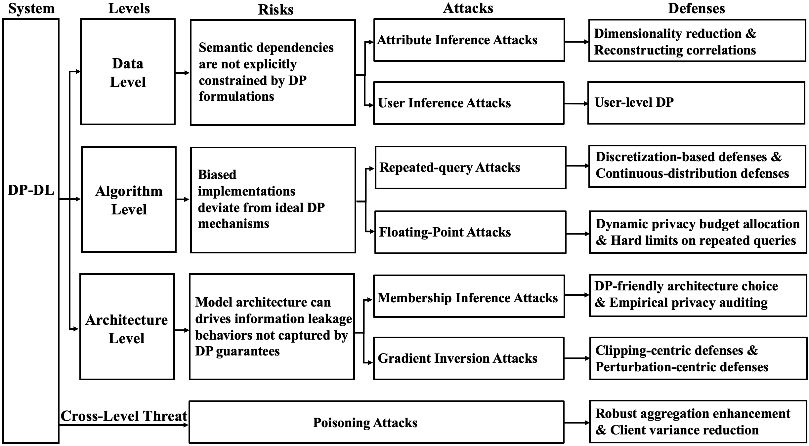
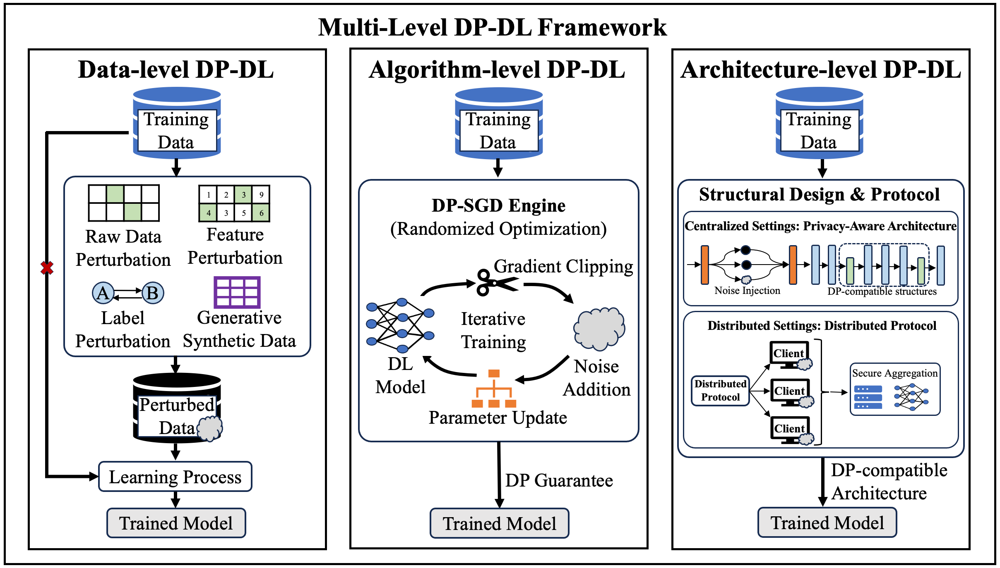
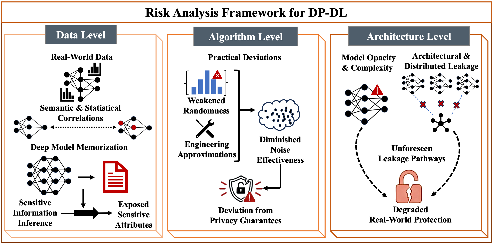
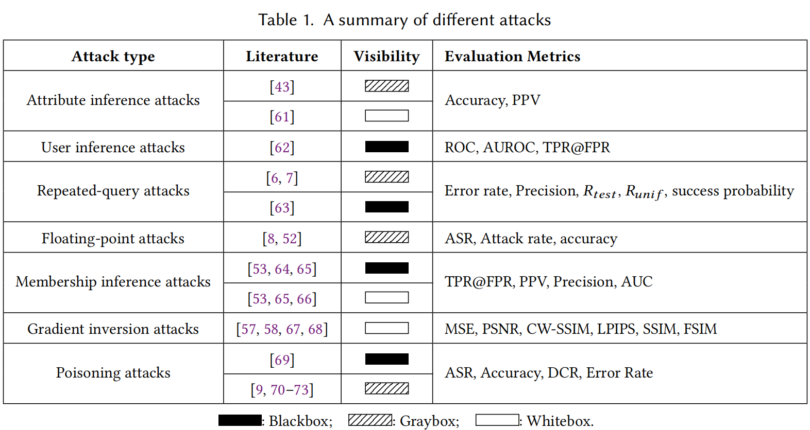
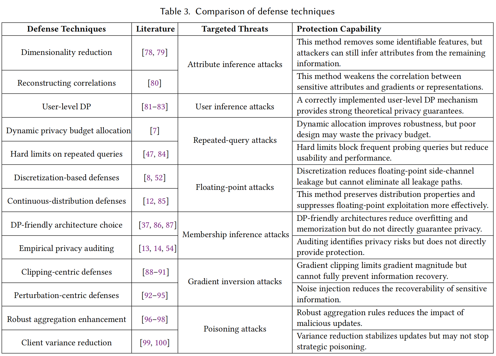

# Attacks and Defenses in Differentially Private Deep Learning: New Security Risks in New Era
<a href="https://www.preprints.org/manuscript/202603.1179" 
   target="_blank" 
   style="display: inline-block; padding: 10px 20px; background-color: #24292e; color: white; text-decoration: none; border-radius: 6px; font-weight: bold;">
   📥 Download Full Paper (PDF)
</a>


With the rapid advancement of deep learning, differential privacy has become a key technique for protecting sensitive data with a formal guarantee of privacy. By injecting noise and enforcing privacy budgets, differentially private deep learning (DP-DL) systems are able to protect individual data points yet still maintain a model’s utility. However, recent studies reveal that DP-DL systems can be vulnerable to different types of attacks throughout their lifecycle. Naturally, this has attracted the attention of both academia and industry. Critically, these risks are not the same as those associated with traditional deep learning. This is because the differential privacy mechanism itself introduces new attack surfaces that adversaries can exploit. Our work focuses on the distinct vulnerabilities that can arise at the data, algorithm, and architecture levels. By analyzing representative attacks and corresponding defenses, this survey highlights emerging challenges and outlines promising research directions. Overall, our aim is to make differential privacy more robust and deployable in real-world deep learning systems.

**📍 This survey systematically examines attacks and defenses on DP-DL systems from three perspectives: data level, algorithm level, and architecture level.**


## Update Records
- 2026-03-15: The first version of our survey has been released on preprints.

## Table of Contents
- [Multi-level DP-DL Frameworks](#Multi-level-DP-DL-Frameworks)
- [Risks in DP-DL](#Risks-in-DP-DL)
- [Attacks on DP-DL systems](#Attacks-on-DP-DL-systems)
- [Defenses for DP-DL systems](#Defenses-for-DP-DL-systems)
- [Update Records](#update-records)
- [Paper List](#paper-list)
  - [Multi-level DP-DL Frameworks](#Multi-level-DP-DL-Frameworks)
  - [Risks in DP-DL](#Risks-in-DP-DL)
  - [Attacks on DP-DL systems](#Attacks-on-DP-DL-systems)
  - [Defenses for DP-DL systems](#Defenses-for-DP-DL-systems)
- [Citation](#citation)
- [Acknowledgement](#acknowledgement)
- [Contact Us](#contact-us)

## Multi-level DP-DL Frameworks
Focus: introduce a multi-level framework for integrating differential privacy into deep learning at the data, algorithm, and architecture levels.



## Risks in DP-DL
Focus: present a risk analysis framework for DP-DL, highlighting privacy risks across data, algorithm, and architecture levels.



## Attacks on DP-DL systems
Focus: summarize different types of attacks on DP-DL, including their corresponding literature, visibility settings, and evaluation metrics.



## Defenses for DP-DL systems
Focus: compare defense techniques for DP-DL, outlining their related literature, targeted threats, and protection capabilities.




## Paper List

### Multi-level DP-DL Frameworks
- RRN: A Differential Private Approach to Preserve Privacy in Image Classification, IET Image Processing 2023 [[paper](https://doi.org/10.1049/IPR2.12784)]
- LDP-Feat: Image Features with Local Differential Privacy, ICCV 2023.10 [[paper](https://doi.org/10.1109/ICCV51070.2023.01612)]
- Deep Learning with Label Differential Privacy, NeurIPS 2021.12 [[paper](https://proceedings.neurips.cc/paper/2021/hash/e3a54649aeec04cf1c13907bc6c5c8aa-Abstract.html)]
- Antipodes of Label Differential Privacy: PATE and ALIBI, NeurIPS 2021.12 [[paper](https://proceedings.neurips.cc/paper/2021/hash/37ecd27608480aa3569a511a638ca74f-Abstract.html)]
- Differentially Private Sequential Data Synthesis with Structured State Space Models and Diffusion Models, NeurIPS SafeGenAI Workshop 2024 [[paper](https://openreview.net/forum?id=ntsBXjkjm7)]
- From Easy to Hard: Building a Shortcut for Differentially Private Image Synthesis, IEEE S&P 2025.05 [[paper](https://doi.org/10.1109/SP61157.2025.00217)]
- PrivSyn: Differentially Private Data Synthesis, USENIX Security 2021.08 [[paper](https://www.usenix.org/conference/usenixsecurity21/presentation/zhang-zhikun)]
- A Critical Review on the Use (and Misuse) of Differential Privacy in Machine Learning, ACM Computing Surveys 2022 [[paper](https://doi.org/10.1145/3547139)]
- Deep Learning with Differential Privacy, CCS 2016.10 [[paper](https://doi.org/10.1145/2976749.2978318)]
- Differentially-Private Deep Learning from an Optimization Perspective, INFOCOM 2019.04 [[paper](https://doi.org/10.1109/INFOCOM.2019.8737494)]
- Differentially Private Deep Learning with Dynamic Privacy Budget Allocation and Adaptive Optimization, IEEE TIFS 2023 [[paper](https://doi.org/10.1109/TIFS.2023.3293961)]
- DPNAS: Neural Architecture Search for Deep Learning with Differential Privacy, AAAI 2022.02 [[paper](https://doi.org/10.1609/AAAI.V36I6.20586)]
- Toward Training at ImageNet Scale with Differential Privacy, arXiv 2022.01 [[paper](https://arxiv.org/abs/2201.12328)]
- The Distributed Discrete Gaussian Mechanism for Federated Learning with Secure Aggregation, ICML 2021.07 [[paper](http://proceedings.mlr.press/v139/kairouz21a.html)]

### Risks in DP-DL
- Resisting structural re-identification in anonymized social networks, VLDB J 2010.12, [[paper](https://doi.org/10.1007/s00778-010-0210-x)]
- Applications of Differential Privacy in Social Network Analysis: A Survey, IEEE Trans. Knowl. Data Eng. 2023.01 [[paper](https://doi.org/10.1109/TKDE.2021.3073062)]
- Applications of deep learning for the analysis of medical data, Archives of pharmacal research 2019.06 [[paper](https://link.springer.com/article/10.1007/s12272-019-01162-9)]
- Dataset correlation inference attacks against machine learning models, arXiv 2021.12 [[paper](https://arxiv.org/abs/2112.08806)]
- Exploiting attribute correlation for reconstruction attacks on differentially private multi-attributed data, Journal of Information Security and Applications 2025.11 [[paper](https://www.sciencedirect.com/science/article/pii/S2214212625002613?via%3Dihub)]
- Large Language Models Can Be Strong Differentially Private Learners, arXiv 2021.10 [[paper](https://arxiv.org/abs/2110.05679)]
- Differentially Private Fine-tuning of Language Models, In The Tenth International Conference on Learning Representations 2022.01 [[paper](https://openreview.net/forum?id=Q42f0dfjECO)]
- Synthetic Text Generation with Differential Privacy: A Simple and Practical Recipe, In Proceedings of the 61st Annual Meeting of the Association for Computational Linguistics 2023.07 [[paper](https://aclanthology.org/2023.acl-long.74/)]
- Privacy-Preserving In-Context Learning with Differentially Private Few-Shot Generation, In The Twelfth International Conference on Learning Representations 2024.01 [[paper](https://openreview.net/forum?id=oZtt0pRnOl)]
- Mind the Privacy Unit! User-Level Differential Privacy for Language Model Fine-Tuning, arXiv 2024.06 [[paper](https://arxiv.org/abs/2406.14322)]
- In Differential Privacy, There is Truth: on Vote-Histogram Leakage in Ensemble Private Learning, arXiv 2022.09 [[paper](https://arxiv.org/abs/2209.10732)]
- Implicit Bias in Noisy-SGD: With Applications to Differentially Private Training. In International Conference on Artificial Intelligence and Statistics 2024.05 [[paper](https://proceedings.mlr.press/v238/sander24a.html)]
- Differentially Private Learning with Small Public Data. In The Thirty-Fourth AAAI Conference on Artificial Intelligence 2020.02  [[paper](https://cs.nju.edu.cn/zhouzh/zhouzh.files/publication/aaai20ppsgd.pdf)]
- Learning Model-Based Privacy Protection under Budget Constraints. In Thirty-Fifth AAAI Conference on Artificial Intelligence 2021.02 [[paper](https://www.semanticscholar.org/paper/Learning-Model-Based-Privacy-Protection-under-Hong-Wang/c398f8a81d10c0d582dfae6d7896870d0acd6d82)]
- Private non-smooth erm and sco in subquadratic steps. Advances in Neural Information Processing Systems 2021 [[paper](https://proceedings.neurips.cc/paper_files/paper/2021/file/211c1e0b83b9c69fa9c4bdede203c1e3-Paper.pdf)]
- On significance of the least significant bits for differential privacy. In the ACM Conference on Computer and Communications Security 2012.10 [[paper](https://dl.acm.org/doi/10.1145/2382196.2382264)]
- Are We There Yet? Timing and Floating-Point Attacks on Differential Privacy Systems. In 43rd IEEE Symposium on Security and Privacy 2022.05 [[paper](https://ieeexplore.ieee.org/document/9833672)]
- Precision-based attacks and interval refining: how to break, then fix, differential privacy on finite computers. arXiv 2022.07 [[paper](https://arxiv.org/abs/2207.13793)]
- Auditing privacy budget of differentially private neural network models, Neurocomputing 2025.01, [[paper](https://www.sciencedirect.com/science/article/abs/pii/S0925231224015273?via%3Dihub)]
- Tighter Privacy Auditing of DP-SGD in the Hidden State Threat Model. arXiv 2024.05 [[paper](https://arxiv.org/abs/2405.14457)]
- Evaluating Differentially Private Machine Learning in Practice, USENIX Security 2019.08, [[paper](https://www.usenix.org/conference/usenixsecurity19/presentation/jayaraman)]
- Nearly Tight Black-Box Auditing of Differentially Private Machine Learning, NeurIPS 2024.12, [[paper](http://papers.nips.cc/paper_files/paper/2024/hash/ed93b2b5722acc2341d421b8916404a1-Abstract-Conference.html)]
- Auditing Privacy Defenses in Federated Learning via Generative Gradient Leakage, CVPR 2022.06, [[paper](https://doi.org/10.1109/CVPR52688.2022.00989)]
- Gradient Obfuscation Gives a False Sense of Security in Federated Learning, USENIX Security 2023.08, [[paper](https://www.usenix.org/conference/usenixsecurity23/presentation/yue)]
- Local Differential Privacy Is Not Enough: A Sample Reconstruction Attack Against Federated Learning With Local Differential Privacy, IEEE TIFS 2025, [[paper](https://doi.org/10.1109/TIFS.2024.3515793)]
- Does Differential Privacy Really Protect Federated Learning From Gradient Leakage Attacks?, IEEE TMC 2024, [[paper](https://doi.org/10.1109/TMC.2024.3417930)]
- Reconstructing Individual Data Points in Federated Learning Hardened with Differential Privacy and Secure Aggregation, EuroS&P 2023.07, [[paper](https://doi.org/10.1109/EUROSP57164.2023.00023)]
- Auditing differentially private machine learning: how private is private SGD?, In Proceedings of the 34th International Conference on Neural Information Processing Systems 2020 [[paper](https://proceedings.neurips.cc/paper/2020/file/fc4ddc15f9f4b4b06ef7844d6bb53abf-Paper.pdf)]
- Threats to Training: A Survey of Poisoning Attacks and Defenses on Machine Learning Systems, ACM Computing Surveys 2023.12, [[paper](https://doi.org/10.1145/3538707)]

### Attacks on DP-DL systems
- Are Attribute Inference Attacks Just Imputation?, CCS 2022.11 [[paper](https://doi.org/10.1145/3548606.3560663)]
- Dataset Correlation Inference Attacks Against Machine Learning Models, arXiv 2021.12 [[paper](https://arxiv.org/abs/2112.08806)]
- User Inference Attacks on Large Language Models, EMNLP 2024.11 [[paper](https://doi.org/10.18653/V1/2024.EMNLP-MAIN.1014)]
- Averaging Attacks on Bounded Noise-based Disclosure Control Algorithms, PoPETs 2020 [[paper](https://doi.org/10.2478/popets-2020-0031)]
- In Differential Privacy, There is Truth: On Vote-Histogram Leakage in Ensemble Private Learning, NeurIPS 2022 [[paper](https://proceedings.neurips.cc/paper_files/paper/2022/file/ba8d1b46292c5e82cbfb3b3dc3b968af-Paper-Conference.pdf)]
- Monitoring-Based Differential Privacy Mechanism Against Query Flooding-Based Model Extraction Attack, IEEE TDSC 2022 [[paper](https://doi.org/10.1109/TDSC.2021.3069258)]
- Are We There Yet? Timing and Floating-Point Attacks on Differential Privacy Systems, IEEE S&P 2022.05 [[paper](https://doi.org/10.1109/SP46214.2022.9833672)]
- On Significance of the Least Significant Bits for Differential Privacy, CCS 2012.10 [[paper](https://doi.org/10.1145/2382196.2382264)]
- Membership Inference Attack against Differentially Private Deep Learning Model, Transactions on Data Privacy 2018 [[paper](http://www.tdp.cat/issues16/tdp.a289a17.pdf)]
- Evaluating Differentially Private Machine Learning in Practice, USENIX Security 2019.08 [[paper](https://www.usenix.org/conference/usenixsecurity19/presentation/jayaraman)]
- Membership Inference Attacks Against Machine Learning Models, IEEE S&P 2017.0, [[paper](https://doi.org/10.1109/SP.2017.41)]
- Membership Inference Attack on Differentially Private Block Coordinate Descent, PeerJ Computer Science 2023 [[paper](https://doi.org/10.7717/peerj-cs.1616)]
- Privacy Risk in Machine Learning: Analyzing the Connection to Overfitting, IEEE CSF 2018.07 [[paper](https://doi.org/10.1109/CSF.2018.00027)]
- Deep Leakage from Gradients, NeurIPS 2019.12, [[paper](https://proceedings.neurips.cc/paper/2019/hash/60a6c4002cc7b29142def8871531281a-Abstract.html)]
- Inverting Gradients – How Easy Is It to Break Privacy in Federated Learning?, NeurIPS 2020.12 [[paper](https://proceedings.neurips.cc/paper/2020/hash/c4ede56bbd98819ae6112b20ac6bf145-Abstract.html)]
- See Through Gradients: Image Batch Recovery via GradInversion, CVPR 2021.06 [[paper](https://doi.org/10.1109/CVPR46437.2021.01607)]
- Does Differential Privacy Really Protect Federated Learning From Gradient Leakage Attacks?, IEEE TMC 2024 [[paper](https://doi.org/10.1109/TMC.2024.3417930)]
- Local Differential Privacy Is Not Enough: A Sample Reconstruction Attack Against Federated Learning With Local Differential Privacy, IEEE TIFS 2025 [[paper](https://doi.org/10.1109/TIFS.2024.3515793)]
- Does Differential Privacy Really Protect Federated Learning From Gradient Leakage Attacks?, IEEE TMC 2024 [[paper](https://doi.org/10.1109/TMC.2024.3417930)]
- GI-NAS: Boosting Gradient Inversion Attacks Through Adaptive Neural Architecture Search, IEEE TIFS 2025 [[paper](https://doi.org/10.1109/TIFS.2025.3589127)]
- Evaluating Privacy Loss in Differential Privacy Based Federated Learning, Future Generation Computer Systems 2025 [[paper](https://doi.org/10.1016/j.future.2025.107848)]
- Auditing differentially private machine learning: how private is private SGD?. In Proceedings of the 34th International Conference on Neural Information Processing Systems 2020 [[paper](https://proceedings.neurips.cc/paper/2020/file/fc4ddc15f9f4b4b06ef7844d6bb53abf-Paper.pdf)]
- - Mean Aggregator Is More Robust than Robust Aggregators under Label Poisoning Attacks on Distributed Heterogeneous Data, JMLR 2025 [[paper](http://jmlr.org/papers/v26/27.html)]
- Manipulation Attacks in Local Differential Privacy, IEEE S&P 2021.05 [[paper](https://doi.org/10.1109/SP40001.2021.00001)]
- On Evaluating the Poisoning Robustness of Federated Learning under Local Differential Privacy, arXiv 2025.09 [[paper](https://arxiv.org/abs/2509.05265)]
- DP-Poison: Poisoning Federated Learning under the Cover of Differential Privacy, ACM Transactions on Privacy and Security 2025 [[paper](https://doi.org/10.1145/3702325)]
- Model Poisoning Attack in Differential Privacy-Based Federated Learning, Information Sciences 2023 [[paper](https://doi.org/10.1016/j.ins.2023.02.025)]

### Defenses for DP-DL systems
- Principal Component Analysis in the Local Differential Privacy Model, IJCAI 2019.08 [[paper](https://doi.org/10.24963/IJCAI.2019/666)]
- Stochastic Algorithms with Descent Guarantees for ICA, AISTATS 2019.04 [[paper](http://proceedings.mlr.press/v89/ablin19a.html)]
- Causal Feature Selection for Algorithmic Fairness, SIGMOD 2022.06 [[paper](https://doi.org/10.1145/3514221.3517909)]
- Automated Feature Engineering for Algorithmic Fairness, VLDB 2021 [[paper](https://doi.org/10.14778/3461535.3463474)]
- DP-GAN: Differentially Private Consecutive Data Publishing Using Generative Adversarial Nets, Journal of Network and Computer Applications 2021 [[paper](https://doi.org/10.1016/j.jnca.2021.103066)]
- DP-VAE: Human-Readable Text Anonymization for Online Reviews with Differentially Private Variational Autoencoders, The ACM Web Conference 2022.04 [[paper](https://doi.org/10.1145/3485447.3512232)]
- PrivDiffuser: Privacy-Guided Diffusion Model for Data Obfuscation in Sensor Networks, PoPETs 2025 [[paper](https://doi.org/10.56553/popets-2025-0118)]
- Learning with User-Level Privacy, NeurIPS 2021.12, [[paper](https://proceedings.neurips.cc/paper/2021/hash/67e235e7f2fa8800d8375409b566e6b6-Abstract.html)]
- User-Level Differential Privacy With Few Examples Per User, NeurIPS 2023.12 [[paper](http://papers.nips.cc/paper_files/paper/2023/hash/3d57795f0e263aa69577f1bbceade46b-Abstract-Conference.html)]
- Fine-Tuning Large Language Models with User-Level Differential Privacy, arXiv 2024.07 [[paper](https://arxiv.org/abs/2407.07737)]
- Monitoring-Based Differential Privacy Mechanism Against Query Flooding-Based Model Extraction Attack, IEEE TDSC 2022 [[paper](https://doi.org/10.1109/TDSC.2021.3069258)]
- The Optimal Upper Bound of the Number of Queries for Laplace Mechanism under Differential Privacy, Information Sciences 2019 [[paper](https://doi.org/10.1016/j.ins.2019.07.001)]
- Privacy Odometers and Filters: Pay-as-you-Go Composition, NeurIPS 2016.12 [[paper](https://proceedings.neurips.cc/paper/2016/hash/58c54802a9fb9526cd0923353a34a7ae-Abstract.html)]
- Are We There Yet? Timing and Floating-Point Attacks on Differential Privacy Systems, IEEE S&P 2022.05 [[paper](https://doi.org/10.1109/SP46214.2022.9833672)]
- Precision-Based Attacks and Interval Refining: How to Break, Then Fix, Differential Privacy on Finite Computers, arXiv 2022.07 [[paper](https://arxiv.org/abs/2207.13793)]
- On Significance of the Least Significant Bits for Differential Privacy, CCS 2012.10 [[paper](https://doi.org/10.1145/2382196.2382264)]
- Securing Floating-Point Arithmetic for Noise Addition. In Proceedings of the 2024 on ACM SIGSAC Conference on Computer and Communications Security 2024.09 [[paper](https://dl.acm.org/doi/10.1145/3658644.3690347)]
- DP-SGD Without Clipping: The Lipschitz Neural Network Way. In The Twelfth International Conference on Learning Representations, ICLR 2024.05 [[paper](https://openreview.net/forum?id=BEyEziZ4R6)]
- Dpnas: Neural architecture search for deep learning with differential privacy. In Proceedings ofthe AAAI conference on artificial intelligence 2022.06 [[paper](https://ojs.aaai.org/index.php/AAAI/article/view/20586)]
- Tempered sigmoid activations for deep learning with differential privacy, In Proceedings ofthe AAAI conference on artificial intelligence 2021.05 [[paper](https://ojs.aaai.org/index.php/AAAI/article/view/17123)]
- Losing Less: A Loss for Differentially Private Deep Learning, PoPETs 2023 [[paper](https://doi.org/10.56553/popets-2023-0083)]
- Auditing Privacy Budget of Differentially Private Neural Network Models, Neurocomputing 2025 [[paper](https://doi.org/10.1016/j.neucom.2024.128756)]
- Tighter Privacy Auditing of DP-SGD in the Hidden State Threat Model, arXiv 2024.05 [[paper](https://arxiv.org/abs/2405.14457)]
- Nearly tight black-box auditing of differentially private machine learning, Advances in Neural Information Processing Systems 2024 [[paper](https://proceedings.neurips.cc/paper_files/paper/2024/hash/ed93b2b5722acc2341d421b8916404a1-Abstract-Conference.html)]
- Exploring the Privacy-Accuracy Trade-Off Using Adaptive Gradient Clipping in Federated Learning, IEEE TNSE 2025 [[paper](https://doi.org/10.1109/TNSE.2025.3546777)]
- Adap DP-FL: Differentially Private Federated Learning with Adaptive Noise, TrustCom 2022.12, [[paper](https://doi.org/10.1109/TRUSTCOM56396.2022.00094)]
- ADPFL: Adaptive Differential Privacy-Enhanced Federated Learning, IEEE Internet of Things Journal 2025 [[paper](https://doi.org/10.1109/JIOT.2025.3611410)]
- Securing Distributed SGD Against Gradient Leakage Threats, IEEE TPDS 2023 [[paper](https://doi.org/10.1109/TPDS.2023.3273490)]
- Staged Noise Perturbation for Privacy-Preserving Federated Learning, IEEE TSUSC 2024 [[paper](https://doi.org/10.1109/TSUSC.2024.3381812)]
- Towards Adaptive Privacy Protection for Interpretable Federated Learning, IEEE TMC 2024 [[paper](https://doi.org/10.1109/TMC.2024.3443862)]
- More Than Enough Is Too Much: Adaptive Defenses Against Gradient Leakage in Production Federated Learning, IEEE/ACM TON 2024 [[paper](https://doi.org/10.1109/TNET.2024.3377655)]
- BVDFed: Byzantine-Resilient and Verifiable Aggregation for Differentially Private Federated Learning, Frontiers in Computer Science 2024 [[paper](https://doi.org/10.1007/S11704-023-3142-5)]
- DP-BREM: Differentially-Private and Byzantine-Robust Federated Learning with Client Momentum, USENIX Security 2025.08 [[paper](https://www.usenix.org/conference/usenixsecurity25/presentation/gu-xiaolan)]
- Noise-Aware Algorithm for Heterogeneous Differentially Private Federated Learning, ICML 2024.07 [[paper](https://proceedings.mlr.press/v235/malekmohammadi24a.html)]
- Differentially Private and Heterogeneity-Robust Federated Learning with Theoretical Guarantee, IEEE TAI 2024 [[paper](https://doi.org/10.1109/TAI.2024.3446759)]
- DP-FedEwc: Differentially Private Federated Elastic Weight Consolidation for Model Personalization, Knowledge-Based Systems 2024 [[paper](https://doi.org/10.1016/j.knosys.2024.112401)]


## Citation
If you find this survey useful, please cite:
```bibtex
@article{202603.1179,
	doi = {10.20944/preprints202603.1179.v1},
	url = {https://doi.org/10.20944/preprints202603.1179.v1},
	year = 2026,
	month = {March},
	publisher = {Preprints},
	author = {Kaiyan Zhao and Zhe Sun and Lihua Yin and Tianqing Zhu},
	title = {Attacks and Defenses in Differentially Private Deep Learning: New Security Risks in New Era},
	journal = {Preprints}
}
```

## Acknowledgement
Thanks to all collaborators and the open-source research community whose work is summarized in this repository.

## Contact Us
For suggestions or corrections, please contact:
- kaiyan.zhao@outlook.com
